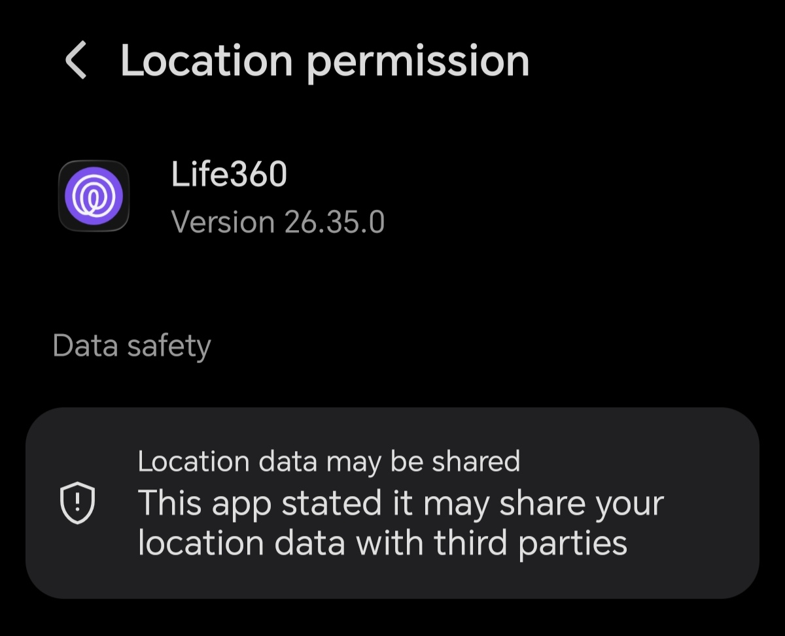

# Free360

Free360 is a location-sharing app modeled after Life360. A group can use a Supabase project or [run its own independent server with Docker](docker/README.md). Each group uses an app build configured for its backend. Members do not need an account, email address, or password.

The app encrypts location snapshots, paused status, and check-ins on the device before uploading them. Either backend stores encrypted envelopes, random device and circle IDs, invitation hashes and expiry times, and delivery timestamps. The circle encryption key stays on members' devices and in one-time invitation QR codes. The database retains one latest snapshot per device, the most recent 100 check-ins, and 24 hours of encrypted location trail points per device.

## Set up a server with Supabase

For the Supabase option, **one project can host multiple independent circles**. Each phone currently belongs to one circle; each circle supports up to 20 devices. Everyone using the same project can use the same app build. The administrator sets up the project once:

1. Create a Supabase project. Enable **Anonymous Sign-Ins** under Authentication settings -> Sign In/Providers.
2. In the project's SQL Editor, run [`supabase/schema.sql`](supabase/schema.sql), then [`supabase/multi-circle.sql`](supabase/multi-circle.sql), then [`supabase/setup-code-security.sql`](supabase/setup-code-security.sql), in that order. The scripts are idempotent and converge to the same secure state; re-running `schema.sql` after updating the app (for example to pick up new schema such as 24-hour location history) never undoes the setup-code hardening, and re-running the hardening script never affects codes issued after it. For an existing project, applying these scripts preserves its circles and data while removing the singleton limit. Then run:

   ```sql
   select public.free360_new_setup_code();
   ```

   Copy the returned code privately. It is a single-use 16-digit code (shown grouped as `XXXX-XXXX-XXXX-XXXX`) that expires after 30 minutes. Run the command again to issue a separate code for another circle. The project stores only sha256 hashes of codes, never plaintext. Members join through the owner's invitation QR and choose their name; device UUIDs come from anonymous authentication.
3. In the repository root, copy `.env.example` to `.env`, keep `EXPO_PUBLIC_BACKEND=supabase`, and replace both Supabase placeholders with your project's URL and **publishable** key. Never place a `service_role` or secret key in the mobile app. Expo embeds `EXPO_PUBLIC_` values in the app bundle; the database's access rules protect the data.
4. Install dependencies and start Expo:

   ```bash
   npm install
   npm start
   ```

5. On the owner's device, open **You → Create a private circle**, enter a circle name and the setup code, and create the circle. Then open **Invite** to show a one-time QR code. Other members need an app build configured with the **same Supabase project** and can join by scanning that QR code. An invitation expires after 15 minutes and can be claimed only once.

6. Deploy the `create-circle` Edge Function. Circle creation goes through this function, which verifies the device's session and redeems the setup code server-side (the legacy direct database call is disabled):

   ```sh
   npx supabase login
   npx supabase link --project-ref YOUR_PROJECT_REF
   npx supabase functions deploy create-circle --no-verify-jwt
   ```

   The function validates the bearer's session with Supabase Auth itself (that is why it deploys with `--no-verify-jwt`), never accepts a client-supplied user identity, and returns sanitized JSON errors. The service-role key stays in the Edge Function environment, never the app. This step is required: without it, creating a circle fails. Re-deploy the function after updating the app.

For EAS builds, set the same two `EXPO_PUBLIC_SUPABASE_*` variables in the build environment. Multiple circles within the same project share the build. Invitation QR codes identify the project, so an invitation for a different backend is rejected.

## How managed Supabase access works

The database supports independent circles. A circle's owner is the device that created it with a one-time setup code. Only that owner can issue invitations. A claim is atomic: one anonymous device session can consume an invitation, after which it is unavailable. Circle creation is atomic the same way: redeeming a setup code, creating the circle, and joining the owner happen in one transaction guarded by a row lock, so two devices racing the same code produce exactly one circle and the loser is told the code is used; if the insert fails, the code stays valid. The database limits each circle to 20 devices and each device to one circle. Redemption is service-only: the `create-circle` Edge Function passes the Auth user id verified from the request bearer token, and the database function accepts no client-provided identity. Guessing is throttled persistently in the database (10 attempts per device-account and 200 project-wide per 10 minutes), so limits hold across function instances. Row-level security allows members to read only their circle's encrypted data. Writes derive the sender from the authenticated session rather than trusting a supplied device ID.

### Setup-code limitations

- Applying the scripts above permanently invalidates old outstanding codes from before this hardening (the pre-expiry 64-hex format): they expire on first apply and cannot be revived. Issue fresh 16-digit codes afterwards. App builds that still call the legacy `free360_create_circle` database function directly stop working once the scripts are applied (permission denied); they must upgrade to a build that uses the `create-circle` Edge Function.
- A code's 16 digits carry ~53 bits of entropy. The sha256 hashes stored in the database resist online guessing (see throttling above), but anyone who obtains a hash dump could brute-force a live code offline within its 30-minute window, and an expired/used code indefinitely. Treat project database access as sensitive.
- Throttling is per device-account plus a project-wide backstop. Deliberately, client IP headers (`X-Forwarded-For` and friends) are NOT used: they are client-controlled and no Edge Function request header is documented as unspoofable. An attacker cycling fresh anonymous accounts (and IPs) is therefore only capped by the project-wide 200-attempts-per-10-minutes backstop; against the 10^16 code space that still makes online guessing infeasible, but it is the binding constraint, so keep the backstop low and report abuse.
- Consumed and expired codes are retired after 7 days to bound table growth. After retirement, retrying such a code reports "invalid" rather than "already used"/"expired".
- The self-hosted Docker backend is unchanged by all of the above; it keeps its own 64-hex setup code and endpoints.

## Names, homes, battery, and notifications

Choose a name when creating or joining a circle. Existing members can use **You → Your name, home and notifications**. A name is a display label tied to the device UUID, not a verified identity. Names, home coordinates, and last reported battery percentages are encrypted inside snapshots. Unsupported battery readings are omitted. Battery values are refreshed when snapshots are sent and may be stale while a phone is offline.

Save your own home using your current location or latitude/longitude. Homes appear on the map and are shared with circle members, including while location sharing is paused. Clear both coordinate fields to remove a home. Each device has one saved home with a 150 metre geofence. Enable background location sharing on the travelling phone to monitor all known circle homes. Homes are cached on the phone when the app syncs; open the app after someone adds or changes a home.

Geofence transitions create encrypted activity entries such as "Alex arrived at Sam's home." Initial states and rapid boundary changes are suppressed to reduce false alerts. The latest 20 pending home alerts are retried after reconnect or a background location update. Alerts depend on OS scheduling, location permissions, connectivity, and the app not being force-stopped. They are not guaranteed immediate delivery.

To enable Supabase push delivery, apply the SQL scripts above and deploy [`notify-circle`](supabase/functions/notify-circle/index.ts):

```sh
npx supabase login
npx supabase link --project-ref YOUR_PROJECT_REF
npx supabase functions deploy notify-circle --no-verify-jwt
```

The function explicitly validates bearer tokens using Supabase Auth and only sends to other members of that user's circle. It throttles sends to one per minute per sender. The service-role key stays in the Edge Function environment, never the app. Push tokens are stored in a restricted table. Push bodies are generic; names and home addresses are not sent to Expo/APNs/FCM. Tap a notification to open encrypted activity details. Push acceptance does not guarantee delivery; this implementation handles immediate invalid-token errors but does not poll later delivery receipts.

Link the app to an EAS project, configure Android FCM/iOS APNs credentials, and make a new development build with the notification plugin. Follow [Expo's push setup](https://docs.expo.dev/push-notifications/push-notifications-setup/). Expo Go cannot test the complete background/push flow. In the installed build, join a circle, then use the profile screen's **Enable notifications** button on each receiving phone. If Expo push security is enabled, configure `EXPO_ACCESS_TOKEN` as a backend secret.

The Docker backend also supports names, homes, battery, and push alerts after rebuilding its container. It remains one circle per standalone server; see [Docker instructions](docker/README.md).

Keep invitation QRs private until claimed: they contain the circle's encryption key. Supabase project administrators can see metadata and encrypted envelopes, but not plaintext coordinates or check-in text. The existing app does not rotate the group key when someone leaves. To permanently exclude a former member, create a fresh server or project and circle with the remaining members.

Anonymous sessions and the circle key live on each device. If a device loses its app data, it must join again with a new invitation. If the owner loses its app data, the existing circle cannot issue new invitations; create a fresh server or project and circle.

## Location behavior

Sharing is off until a member enables it. Foreground updates and check-ins upload through HTTPS; the app checks for updates while open (every five seconds with the standalone server). While the app is open, every member's locations are refreshed from the server every five minutes, alongside realtime updates. The app stores an encrypted 24-hour location trail per device: trail points are added at most every five minutes after meaningful movement (or on jumps of a kilometer or more), so a stationary phone does not accumulate duplicate points. Tap a member and choose **Show 24-hour trail on map** to see where they have been; the trail older than 24 hours is deleted server-side on every publish. The latest encrypted snapshot is queued on the device during an outage and retried after reconnect. Intermediate points between stored trail points are not retained. A stale map marker is not a safety confirmation.

Expo Go can preview the app, but continuous background location requires a development build. Test on physical Android and iOS devices before relying on background delivery; OS scheduling, permissions, connectivity, and force-quits can interrupt it. Free360 does not provide emergency response or automatic safety alerts.

```bash
npx eas-cli@latest build:configure
npx eas-cli@latest build --profile development --platform android
```

## Map rendering

Free360 renders OpenStreetMap tiles with a bundled Leaflet map in `react-native-webview` on Android and iOS, and an iframe on web. It does not use the Google Maps SDK or require a Google Maps API key. Member avatars, homes, marker taps, recentering, and location trails use this map.

Existing development builds need to be rebuilt after installing the WebView native module (`npm run android` locally, or a new EAS development build). Expo Go already includes WebView. Only tiles require network access; Leaflet's JavaScript and CSS are bundled with the app. Tiles follow the [OpenStreetMap tile usage policy](https://operations.osmfoundation.org/policies/tiles/), including visible attribution and normal HTTP caching.

After changing the Leaflet version, run `npm run bundle:leaflet` to regenerate its bundled JavaScript, CSS, and license.

## Verify the code

```bash
npx expo lint
npx tsc --noEmit
npx expo-doctor
```
